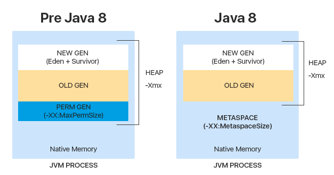
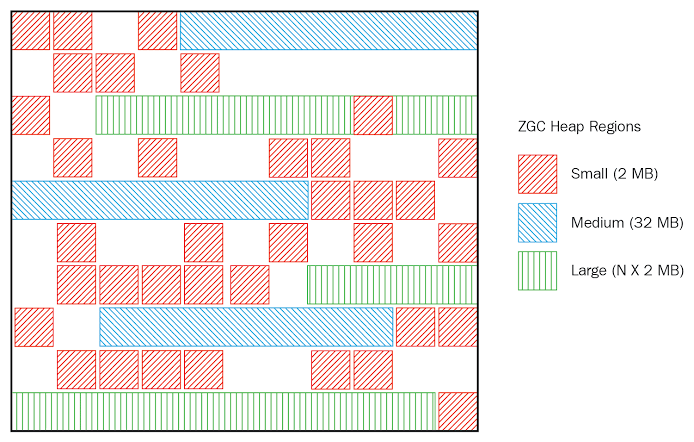
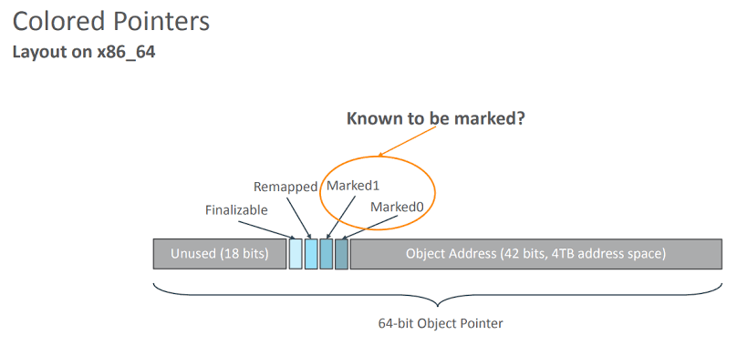

# Java Garbage Collection

## Heap

The Heap is divided into several parts called generations:

- Young generation is a field, where recently created objects are stored;
- Old (tenured) generation is a field, where long-life objects are stored;

Before Java 8, there was one more memory space — Permanent generation. it contained meta-information about classes, methods, statistical variables. After Java 8 was invented, all this information then became stored separately in the Metaspace.

> Stack object access is thread-safe while heap access is not!



> Why was the decision taken to get rid of Permanent generation?

First of all, it was because of the error connected with memory overflow. Since the Perm had a constant size and could not expand dynamically, sooner or later the memory ran out, an error was thrown and application crashed.

In contrast, Metaspace has a dynamic size, and during its execution, it can expand up to the memory size of the JVM.

Key Heap features:

- If Heap space is full, Java throws java.lang.OutOfMemoryError
- Access to the Heap is relatively slower in comparison to the Stack
- To remove unused objects from the memory in the Heap, a Garbage collector is used
- Unlike stack, a heap isn’t thread-safe and needs to be guarded by properly synchronizing the code

## Garbage Collector

Garbage collector is a programme that works in JVM and is intended to delete objects that are no longer used or needed.

> Different JVMs can have different algorithms of garbage collection, so there are a variety of different garbage collectors in Java.

Heap memory is divided into 2 sections called Generations: New generation and Old generation.


New generation includes 3 regions: Eden, Survivor 0, and Survivor 1.

Old generation includes the Tenured region.

> So what happens when we create a new object in Java?

---

## Garbage Collectors in Java

### G1 Garbage Collector

G1 is introduced in **Java7**. Oracle 9 Hotspot JVM comes with default G1 Garbage collection.

You can configure this for maximum pause time using flag `
-XX:MaxGCPauseMillis=n`.

> Lots of real-world studies say most of the objects (90%) garbage collected in a young generation or in first garbage collection or minor GC (also it depends upon applications). Who survived a couple of GCs(major GC), present in old memory (old objects) they will remain survive more than 95% times.

#### G1 Working

- It does most of the work concurrently.
- It uses non-continuous which enables G1 to deal with the very large heap efficiently.
- Instead of dividing heaps into 3 spaces (old) like other Garbage Collectors like CMS (concurrent mark and sweep), Parallel etc, **it divides heap memory in small chunks. These regions are fix-sized (about 2Mb by default)**

Earlier


G1


- Splitting into small regions helps G1 concurrently run and finish it off very quickly.
- While running GC on Eden space all the survived objects get copied to unassigned space. *The unassigned space becomes survivor space*.
- *If all the objects in Eden space are garbage then it can be declared as Unassigned*.
- **G1 is not run on whole heap memory at once** like others Garbage Collectors, instead of this **it always selects the regions which are full or almost full** to minimizes the amount of work to free heap space.
- **G1 only stops the application at the beginning of the GC for boot strapping** , this phase is called as **Initial Mark**.
- While Application is executing it follow all the references and mark live objects, this phase called as **Concurrent Mark**.
- When above phase(Concurrent Mark) is done then application again stops. for final cleanup is made, this phase called as **Final Mark**.
- To move objects and reclaim heap memory, this phase called as Evacuation phase this phase is fast, called as **Evacuation Phase**.
- **"This is not good for small heaps"** then it that case might be full GC is performed and might slow down overall executions. In that case *increase the heap size or other Garbage collectors can be used*.

#### G1 Extras

##### String deduplication

> Many large-scale Java applications are currently bottlenecked on memory. Measurements have shown that **roughly 25% of the Java heap live data set in these types of applications is consumed by String objects**. Further, **roughly half of those String objects are duplicates**, where duplicates means string1.equals(string2)is true. Having duplicate String objects on the heap is, essentially, just a waste of memory.

Java provides two ways to handle duplicate strings and eliminate memory usage

**1. By using `String.intern()` method:**

```java
String str = “abc”;
String str = new String(“abc”).intern();
```

Notes:

- Intern method is expensive and slow.
- `String.intern()` is a native method, and calling a native method incurs massive overhead.
- The implementation used a fixed size (**default 1009, can be set using `-XX:StringTableSize=N`**) hashtable so as the number entries grew, the performance became O(n).

**2. By enabling string deduplication (only available with G1 garbage collector):**

```sh
XX:+UseG1GC -XX:+UseStringDeduplication
```

Notes:

- This option is only available from **Java 8 Update 20 JDK release**.
- This feature will only work along with the **G1 garbage collector**.
- You need to provide both `-XX:+UseG1GC` and `-XX:+StringDeduplication` JVM options to enable this feature.
- To check if it happens in your system you can use `-XX:+PrintStringDeduplicationStatistics` parameter.
- You can control this by using `-XX:StringDeduplicationAgeThreshold=3` option to change when Strings become eligible for deduplication.

### ZGC

It is a scalable low latency garbage collector designed to meet the following goals:

- Z Garbage Collector (ZGC) is introduced in JAVA-11 as an experimental GC.
- Pause times **do not** exceed **10ms**.
- Pause times **do not** increase with the heap or live-set size.
- Handle heaps ranging from a few hundred megabytes to multi terabytes in size.

#### Properties

- Concurrent
- Region-based
- Compacting=
- NUMA-aware
- Using colored pointers
- Using load barriers

#### Working of ZGC

ZGC divides memory into regions, also called **ZPages**. ZPages are dynamically sized (unlike the G1 GC), which are multiples of 2 MB can be dynamically created and destroyed.

Here are the size groups of heap regions:

- Small(2MB),
- Medium(32MB)
- Large(N * 2 MB)



Notes:

- ZGC heap can have multiple occurrences of these heap regions.
- After ZGC compaction, ZPages are freed up and inserted into a page cache called as **ZPageCache**.
- ZPages in the page cache are ready to be reused to satisfy new heap allocations.
- The page cache is critical for performance, as committing and uncommitting memory are expensive operations.
- ZPages in the page cache represents the unused parts of the heap that could be uncommitted and returned to the operating system.

#### Phases of Z Garbage Collection


**1. Pause Mark Start:**

- In this phase objects that have been pointed to roots. This includes walking through the live set of objects and then finding and marking them.
- It starts with a scanning thread stack which gives the reference objects in heap.
- After getting reference it will walk through all the graphs of objects(which are reachable).
- It also remaps the live data after the end of the last phase(Pause Relocate Phase).

**2. Pause Mark End:**

- This phase with a short pause of 1ms.
- The pause time involved here depends only on the number of roots and the ratio of the sizes of the relocation set and total live set of objects.
- This starts after completion of the first phase.
- This starts with preparing concurrent relocation of objects and marks the regions it wants to compact.
- Now we have all the information which objects are live so it starts with reference processing and moves to week-root cleaning.

**Pause Relocate Start:**

- It triggers the actual region compaction.
- It begins with root scanning pointing into the location set, followed by the concurrent reallocation of objects in the relocation set.

#### Colored Pointers

- Colored pointers are one of the core concepts of ZGC.
- It enables ZGC to find, mark, locate, and remap the objects.
- It doesn’t support x32 or 32 bits operating systems.
- **Load Barrier** uses this to detect whether the object is bad color then do the corresponding action (like remap means object is remapped to a different address). **It is injected by the JIT compiler when the object is fetched from the heap**.



the 64-bit object reference is divided as follows:

- 18 bits: **Unused bits**
- 1-bit: **Finalizable**
- 1-bit: **Remapped**
- 1-bit: **Marked1**
- 1-bit: **Marked0**
- 42 bits: **Object Address**

Explanations:

- The first 18 bits are reserved for future use.
- 42 bits can address up to 4 TB of address space.
- The **Marked1** and **Marked0** bits are used to mark objects for garbage collection. By setting the single bit for **Remapped**, an object can be marked not pointing to the relocation set.
- The last 1-bit for finalizing relates to concurrent reference processing.
